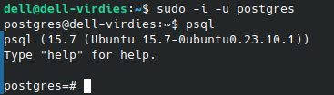
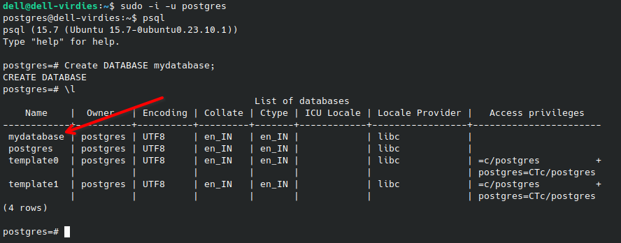

<!-- # PostgreSQL -->
<div style="text-align: center;">
  <h1>PostgreSQL</h1>
</div>


<div style="text-align: center;">
  
</div>


## Table of Content

- [Introduction](#introduction)
- [Key Features](#key-features)
- [Difference between MySQl & Postgresql](#what-is-the-difference-between-postgresql-and-mysql)
- [System Requirements](#system-requirements)

- [Installation & Setup](#installation--setup)
- [SQL keywords](#getting-started)
- [CRUD Operation](#crud-operations)
- [Advance Postgres Operators](#postgres-operators)
- [Conclusion](#conclusion)
- [Reference Links](#reference-links)


## Introduction
PostgreSQL (commonly referred to as “Postgres”) is an free open-source database system that supports both relational (SQL) and non-relational (JSON) queries. It is a back-end database for dynamic websites and web applications.  

It is known for its robustness, flexibility, and standards compliance, PostgreSQL is a popular choice for developers and organizations seeking a reliable database management system (DBMS).  

PostgreSQL supports the most important programming languages:
    
    - Python
    - Java
    - C/C++
    - C#
    - Node.js
    - Go
    - Ruby
    - Perl

PostgreSQL supports basically all features that other database management systems support.

### Key Features:

#### Open Source and Community-Driven:
PostgreSQL is free to use, and its development is driven by a vibrant community of developers and contributors who continuously enhance its capabilities.

#### Advanced SQL Compliance: 
PostgreSQL supports a wide range of SQL standards and features, making it suitable for complex queries and operations. 

<br>


## What is the difference between PostgreSQL and MySQL? 

MySQL is a widely adopted open-source relational database that serves as the primary relational data store for many popular web applications. With more than 20 years of community-backed development and support, MySQL is reliable, stable, and secure.

MySQL and PostgreSQL are both popular open-source relational databases. Traditionally, MySQL has been perceived as easy to use and fast, whereas PostgreSQL has been perceived as feature-rich and more comparable to commercial databases like Oracle.

However, the current major versions of MySQL and PostgreSQL both offer many robust features and capabilities in terms of performance, reliability, security, and more.

#### Which one to use?
Choosing the correct database server depends greatly on your use case and practical implementation. You should go with the server that gives you optimum performance and scale for your requirements. For example, if you need to scale faster to a very large volume, PostgreSQL is a better choice. However, you can choose MySQL if you want a lightweight server than integrates quickly with third-party tools.
<br>
<br>

# Installation & Setup for Linux

### System Requirements:
- **Operating System**: Ubuntu 18.04 or later versions.
- **CPU**: Modern multi-core processor (e.g., Intel Core i5 or AMD Ryzen 5) for small to moderate workloads.
- **Memory (RAM)**:  
    - Development/testing: 2-4 GB RAM.
    - Production/larger databases: 8 GB or more RAM.

To install PostgreSQL, run the following command in the command prompt:
## Installation
### Step 1: Install Postgres on your system

1. Update the package list:

```bash
  sudo apt update  
``` 

2. Install PostgreSQl:

```bash
  sudo apt install postgresql  
``` 

3. Start PostgreSQL service:

```bash
  sudo systemctl start postgresql

``` 

### Step 2: Switch to the PostgreSQL Terminal

postgreSQL uses a concept of roles to handle authentication and authorization. By default, PostgreSQL creates a role called `postgres`.

1. Start PostgreSQL service:
```bash
  sudo systemctl start postgresql
``` 
2. Open postgres on terminal:
```bash
  sudo -i -u postgres
``` 
3. Access the PostgreSQL prompt:
```bash
  psql
``` 
   

<br>

# Getting Started

SQL input consists of a sequence of commands. A command is composed of a sequence of tokens,
terminated by a semicolon (“ ; ”) .  
A token can be a *keyword, an identifier, a quoted identifier, a literal (or constant), or a special character symbol*. 

- **Keywords:** Words that have a fixed meaning in the SQL language. (e.g., SELECT, UPDATE, or VALUES.)  

- **Identifier:** The name of a database object (e.g., table name, column name).  

- **Literal (or constant):** A fixed value represented directly in SQL (e.g., string 'Hello', number 123).  

- **Special character symbol:** Characters with special meaning in SQL syntax (e.g., =, *, ;).

- **Comments:** A comment is a sequence of characters beginning with double dashes and extending to the end of the line, e.g.:   
```-- This is a standard SQL comment```  
Alternatively, multiline comment:   
```
/* multiline comment
* with nesting: /* nested block comment */
*/
```
Keywords and unquoted identifiers are *case-insensitive*. Therefore:  <br>
`UPDATE MY_TABLE SET A = 5;`  
can equivalently be written as:  
`uPDaTE my_TabLE SeT a = 5;`  

The following is (syntactically) valid SQL input:
```
SELECT * FROM MY_TABLE;
UPDATE MY_TABLE SET A = 5;
INSERT INTO MY_TABLE VALUES (3, 'hi there');
```


### Creating a Database:

Create a new database (replace `mydatabase` with your desired database name):
```
CREATE DATABASE mydatabase;
```  
### Creating a new User:
1. Create a new user (replace `myuser` with your desired username):
```  
CREATE USER myuser WITH PASSWORD 'mypassword';
```
2. Grant all privileges on the database to the new user:  
```
GRANT ALL PRIVILEGES ON DATABASE mydatabase TO myuser;
```
   
As we can see new database named as, `mydatabase` is created.  
### Connect to the Database:
1. Connect to the new database using the new user:
```
psql -U myuser -d mydatabase -h localhost
```
2. Enter the password when prompted.

<br>

# CRUD operations

- ### Create Table
The following SQL statement will create a table named `bikes` in your PostgreSQL database:
 ```
 CREATE TABLE bikes (
  brand VARCHAR(255),
  model VARCHAR(255),
  year INT
); 
```
- ### Display Table
You can "display" the empty table you just created with another SQL statement:  
```
SELECT * FROM bikes;
```
Which will give you this result:

```
 brand | model | year
-------+-------+------
(0 rows) 
```
We can use `DISTINCT` with select, so that we can getch unique values.

- ### Insert Data
To insert data into a table in PostgreSQL, we use the `INSERT INTO` statement.

The following SQL statement will insert one row of data into the `bikes` table.
```
INSERT INTO bikes (brand, model, year)
VALUES ('Suzuki', 'Intruder', 1964); 
```
- ### Insert Multiple Rows 
To insert multiple rows of data, we use the same `INSERT INTO` statement, but with multiple values:
```
INSERT INTO bikes (brand, model, year)
VALUES
  ('Royal Enfield', 'Classic 350', 1968),
  ('Honda', 'Unicorn', 1978),
  ('TVS', 'Apache', 1975); 
```
Now, if we display the table using `SELECT`, we'll get:

```
brand  |  model  | year
--------+---------+------
 Suzuki   | Intruder | 1964
 Royal Enfield  | Classic 350   | 1968
 Honda    | Unicorn      | 1978
 TVS | Apache  | 1975
(4 rows)
```
- ### Fetch Data
To retrieve data from a data base, we use the `SELECT` statement.   
By specifying the column names, we can choose which columns to select:
```
 SELECT brand, year FROM bikes; 
```
Now, we'll get
```
brand  | year
--------+------
 Suzuki   | 1964
 Royal Enfield  | 1968
 Honda    | 1978
 TVS | 1975
(4 rows)
```
Specify a `*` instead of the column names to select all columns:
```
 SELECT * FROM bikes; 
 ```
- ### Add Column

The `ALTER TABLE` statement is used to **add, delete, or modify columns** in an existing table.  
We want to add a column named color to our bikes table.
```
ALTER TABLE bikes
ADD color VARCHAR(255); 
```
Now, if we see the table we'll get this:
```
 brand  |  model  | year | color
--------+---------+------+-------
 Suzuki   | Intruder | 1964 |
 Royal Enfield  | Classic 350   | 1968 |
 Honda    | Unicorn      | 1978 |
 TVS | Apache  | 1975 |
(4 rows)
```
As you can see, the `bikes` table now has a `color` column.  
<br>
Now, if we want to change the data type of the year column of the bikes table from INT to VARCHAR(4).
```
ALTER TABLE bikes
ALTER COLUMN year TYPE VARCHAR(4); 
```

- ### Drop Column

To remove a column from a table, we have to use the `ALTER TABLE` statement again as we already know that it is used to **add, delete, or modify columns** in an existing table.  
Now, if we want to remove the column named color from the bikes table, we'll use `DROP COLUMN` statement.
```
ALTER TABLE bikes
DROP COLUMN color; 
```
Now, the table will look like this again.
```
brand  |  model  | year
--------+---------+------
 Suzuki   | Intruder | 1964
 Royal Enfield  | Classic 350   | 1968
 Honda    | Unicorn      | 1978
 TVS | Apache  | 1970
(4 rows)
```  
- ### DELETE 
The `DELETE` statement is used to delete existing records in a table.
```
DELETE FROM bikes
WHERE brand = 'Royal Enfield'; 
```
- ### DELETE All Records
It is possible to delete all rows in a table without deleting the table. This means that the table structure, attributes, and indexes will be intact.  
The following SQL statement deletes all rows in the bikes table, without deleting the table:
```
 DELETE FROM bikes;
```

The same would have been achieved by using the `TRUNCATE TABLE` statement:
```
 TRUNCATE TABLE bikes; 
```
**NOTE:**  If you omit the WHERE clause,
all records in the table will be deleted!.

- ### DROP Table
The `DROP TABLE` statement is used to drop an existing table in a database.
```
 DROP TABLE bikes; 
```
Now, if we try to display the table using `SELECT`, we'll get:
```
ERROR: relation "bikes" does not exist
LINE 1: SELECT * FROM bikes;
                      ^
```
<br>

# Postgres Operators

- ### Equal To 
The `=` operator is used when you want to return all records where a column is equal to a specified value:
```
SELECT * FROM bikes
WHERE brand = 'Royal Enfield'; 
```
- ### Less Than
The `<` operator is used when you want to return all records where a column is less than a specified value.
```
SELECT * FROM bikes
WHERE year < 1975; 
```
### Other some operators are:
`=`	Equal to  
`<`	Less than  
`>`	Greater than  
`<=`	Less than or equal to  
`>=`	Greater than or equal to  
`<>`	Not equal to  
`!=`	Not equal to  
`LIKE`	Check if a value matches a pattern (case sensitive)  
`ILIKE`	Check if a value matches a pattern (case insensitive)  
`AND`	Logical AND  
`OR`	Logical OR  
`IN`	Check if a value is between a range of values  
`BETWEEN`	Check if a value is between a range of values  
`IS NULL`	Check if a value is NULL  
`NOT`	Makes a negative result e.g. `NOT LIKE`, `NOT IN`, `NOT BETWEEN`

<br>

We can operate with different operators in the `WHERE` clause.
- ### WHERE clause
`WHERE` is used to filter the records.  
It is used to extract only those records that fulfill a specified condition.
Now, if we want to return only the records where `city` is `London`, we can specify that in the `WHERE` clause:
```
SELECT * FROM customers
WHERE city = 'London'; 
```
- ### Sort Data
The `ORDER BY` keyword is used to sort the result in ascending or descending order.  
The `ORDER BY` keyword sorts the records in ascending order by default.
```
SELECT * FROM products
ORDER BY price; 
```
 To sort the records in descending order, use the `DESC` keyword.
```
SELECT * FROM products
ORDER BY price DESC; 
```

- ### MIN and MAX Functions
The `MIN()` function returns the smallest value of the selected column.
```
SELECT MIN(price)
FROM products; 
```
The `MAX()` function returns the smallest value of the selected column.
- ### COUNT
The `COUNT()` function returns the number of rows that matches a specified criterion.
```
SELECT COUNT(customer_id)
FROM customers; 
```
- ### SUM & Average
The `SUM()` function returns the total sum of a numeric column. 
```
SELECT SUM(quantity)
FROM order_details; 
```
The `AVG()` function returns the average value of a numeric column.
```
SELECT AVG(price)
FROM products; 
```
- ### LIKE & ILIKE Operator
The `LIKE` operator is used in a `WHERE` clause to search for a specified pattern in a column.

There are two wildcards often used in conjunction with the `LIKE` operator:  
- `%` The percent sign represents zero, one, or multiple characters.
- `_` The underscore sign represents one, single character.

```
SELECT * FROM customers
WHERE customer_name LIKE 'A%'; 
```
**Note:** The `LIKE` operator is case sensitive, if you want to do a case insensitive search, use the `ILIKE` operator instead.

- ### IN & NOT IN Operator
The `IN` operator allows you to specify a list of possible values in the WHERE clause. 
```
SELECT * FROM customers
WHERE country IN ('Germany', 'France', 'UK'); 
```
By using the `NOT` keyword in front of the `IN` operator, you return all records that are NOT any of the values in the list.
```
SELECT * FROM customers
WHERE country NOT IN ('Germany', 'France', 'UK'); 
```

- ### BETWEEN
The `BETWEEN` operator selects values within a given range. The values can be numbers, text, or dates. The `BETWEEN` operator is inclusive: begin and end values are included.
```
SELECT * FROM Products
WHERE Price BETWEEN 10 AND 15; 
```

- ### JOINS
A `JOIN` clause is used to combine rows from two or more tables, based on a related column between them.  
Let's look at a selection from the `products` table:
```
 product_id |  product_name  | category_id
------------+----------------+-------------
         33 | Geitost        |           4
         34 | Sasquatch Ale  |           1
         35 | Steeleye Stout |           1
         36 | Inlagd Sill    |           8
```
Then, look at a selection from the `categories` table:
```
category_id | category_name
-------------+----------------
           1 | Beverages
           2 | Condiments
           3 | Confections
           4 | Dairy Products
```

Notice that the `category_id` column in the `products` table refers to the `category_id` in the `categories` table. The relationship between the two tables above is the `category_id` column.

Then, we can create the following SQL statement (with a JOIN), that selects records that have matching values in both tables:
```
SELECT product_id, product_name, category_name
FROM products
INNER JOIN categories ON products.category_id = categories.category_id; 
```
Results will be:
```
 product_id |  product_name  | category_name
------------+----------------+----------------
         33 | Geitost        | Dairy Products
         34 | Sasquatch Ale  | Beverages
         35 | Steeleye Stout | Beverages
         36 | Inlagd Sill    | Seafood
```
Here are the different types of the Joins in PostgreSQL:

- **INNER JOIN:** Returns records that have matching values in both tables. 
- **LEFT JOIN:** Returns all records from the left table, and the matched records from the right table.
- **RIGHT JOIN**: Returns all records from the right table, and the matched records from the left table.  
- **FULL JOIN:** Returns all records when there is a match in either left or right table.

- ### GROUP BY
The `GROUP BY` clause groups rows that have the same values into summary rows, like "find the number of customers in each country".

The `GROUP BY` clause is often used with aggregate functions like `COUNT()`, `MAX()`, `MIN()`, `SUM()`, `AVG()` to group the result-set by one or more columns.
```
SELECT COUNT(customer_id), country
FROM customers
GROUP BY country; 
```
<br>
<br>

# Conclusion

PostgreSQL is a powerful, open-source relational database management system known for its robustness, flexibility, and extensive feature set. Throughout this documentation, we've explored the essential aspects of PostgreSQL, from installation and basic operations to advanced SQL techniques and administrative tasks.

Key takeaways include:

- **Installation and Configuration:** Proper setup and configuration are crucial for optimal performance and security. PostgreSQL's configurability allows it to be tailored to various use cases and environments.

- **Basic and Advanced SQL:** Understanding the fundamental and advanced SQL operations enables effective data manipulation and querying. Mastering joins, subqueries, indexes, and functions is essential for efficient database management.

<br>

## Reference Links
- [Posgress official documentation](https://www.postgresql.org/)
- [Postgress Tutorials](https://www.postgresqltutorial.com/)